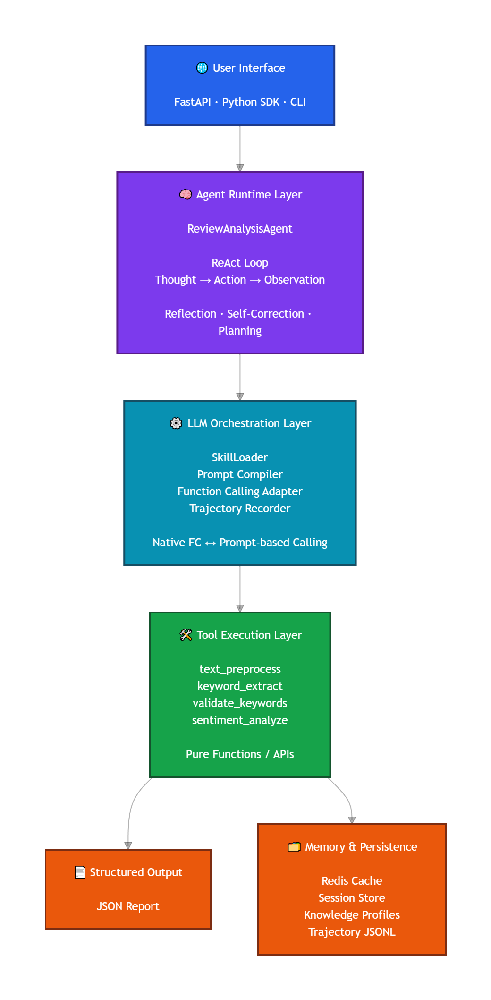
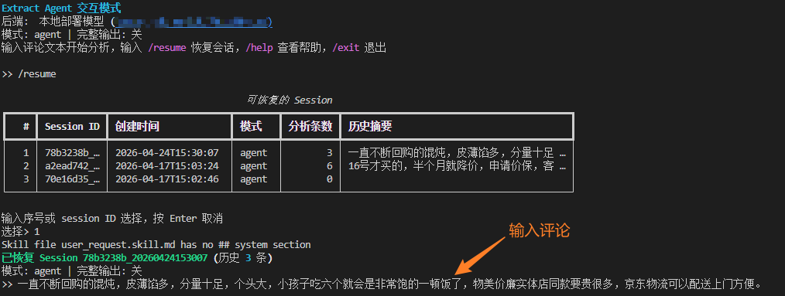

English | [中文](README.md)

# Extract Agent — Chinese E-commerce Review Analysis AI Agent

A review analysis Agent based on the ReAct (Thought → Action → Observation) paradigm, featuring **autonomous planning, iterative tool calling, code-level reflection, and graceful degradation**. Built with a **four-layer architecture** (Skill → Agent → LLM Service → Tool), supporting **trajectory data collection & SFT export**, **knowledge accumulation**, and **multiple interfaces** (Python API / FastAPI HTTP / Interactive CLI).

## Architecture Overview


### Four-Layer Separation of Concerns

| Layer | Responsibility | Key Characteristics |
|-------|---------------|---------------------|
| **Skill Layer** | Define LLM roles, rules, output formats | Pure Markdown, no Python code; supports `{{variable}}` injection |
| **Agent Layer** | ReAct reasoning & tool orchestration | Agnostic to prompt details, no direct LLM API calls |
| **LLM Service Layer** | Unified LLM calls, mode detection, trajectory collection | Centralized retry / token / call mode management |
| **Tool Layer** | Pure computation execution | Unaware of calling context, no LLM call logic |

### Agent ReAct Workflow

The Agent operates through **iterative loops**, not fixed pipelines:



1. After each tool call, review result quality
2. If issues found (duplicates, insufficient quantity, poor quality), retry relevant tools
3. Only proceed to the next step when current results pass quality checks
4. Code-level deduplication runs as a final safeguard after Agent completes

## Directory Structure

```
extract_agent/
├── config.py                       # Global config (dual LLM endpoints + reflector + trajectory + knowledge)
├── requirements.txt                # Python dependencies
├── .env.example                    # Environment variable template
├── README.md                       # Chinese documentation
├── README_EN.md                    # This file
├── __init__.py                     # Package entry
├── __main__.py                     # python -m extract_agent entry
│
├── skills/                         # ① Skill Layer — Pure prompt definitions
│   ├── agent_system.skill.md       # Agent system prompt
│   ├── agent_system_tools.skill.md # Agent system prompt (with tool descriptions)
│   ├── user_request.skill.md       # User request template
│   ├── keyword_extract_long.skill.md   # Long review keyword extraction prompt
│   ├── keyword_extract_short.skill.md  # Short review keyword extraction prompt
│   ├── sentiment_analyze.skill.md  # Sentiment analysis prompt
│   └── reflector.skill.md          # Reflector prompt
│
├── agent/                          # ② Agent Layer — ReAct main loop
│   ├── agent.py                    # ReviewAnalysisAgent + knowledge integration
│   ├── react_loop.py               # ReAct loop executor (native / prompt-based / streaming)
│   ├── fast_path.py                # Pipeline fast analysis (offline / fast)
│   ├── result_assembler.py         # Assembles structured results from Memory
│   ├── memory.py                   # Working memory management
│   └── reflector.py                # LLM reflector
│
├── llm_service/                    # ③ LLM Service Layer
│   ├── models.py                   # SkillPrompt / LLMResponse data models
│   ├── skill_loader.py             # SKILL.md parser + variable injection
│   ├── service.py                  # LLMService (call_agent / call_tool / mode detection)
│   └── trajectory.py               # TrajectoryRecorder trajectory collection
│
├── tools/                          # ④ Tool Layer — Standardized tools
│   ├── base_tool.py                # BaseTool abstract base class + ToolResult
│   ├── preprocess_tool.py          # Text preprocessing tool
│   ├── keyword_extract_tool.py     # Keyword extraction tool
│   ├── jieba_extract_tool.py       # Jieba fallback extraction tool
│   ├── validate_tool.py            # Keyword validation + dedup tool
│   └── sentiment_tool.py           # Sentiment analysis tool
│
├── core/                           # Core capability modules
│   ├── preprocess.py               # Text preprocessing (entry point, combines cleaners submodule)
│   ├── post_process.py             # Keyword post-processing (entry point, combines filters submodule)
│   ├── fallback_extractor.py       # Jieba fallback extraction
│   ├── stopwords.txt               # Stopword list
│   ├── cleaners/                   # Text cleaning submodule
│   │   ├── time_cleaner.py         # Time/date expression removal
│   │   ├── url_cleaner.py          # URL/email/phone number removal
│   │   ├── emoji_cleaner.py        # Emoji/garbled text/special character handling
│   │   └── normalize.py            # Unicode normalization, fullwidth/halfwidth conversion
│   └── filters/                    # Keyword filtering submodule
│       ├── text_alignment.py       # Original text alignment check
│       ├── stopwords.py            # Stopword filtering
│       ├── dedup.py                # Keyword deduplication
│       └── length_filter.py        # Length/English filtering
│
├── trajectory/                     # Trajectory data export
│   ├── exporter.py                 # TrajectoryExporter (load session → export SFT)
│   └── formats.py                  # SFTFormatter (Agent SFT / Tool SFT / supervision triples)
│
├── knowledge/                      # Knowledge accumulation system
│   ├── models.py                   # ReviewerProfile / ProductProfile data models
│   ├── manager.py                  # KnowledgeManager (CRUD + dynamic detail adjustment)
│   └── reporter.py                 # KnowledgeReporter (Rich terminal reports)
│
├── api/                            # FastAPI interface layer
│   ├── app.py                      # FastAPI application entry
│   ├── routes.py                   # Route definitions
│   ├── schemas.py                  # Request/Response Pydantic models
│   ├── metrics.py                  # Prometheus metrics definition & middleware
│   └── redis_client.py             # Redis client wrapper
│
├── cli/                            # Command-line interface
│   ├── main.py                     # Typer app entry, registers all subcommands
│   ├── session.py                  # Session management (directories, metadata, persistence)
│   ├── formatter.py                # Rich terminal formatting & progress bars
│   ├── file_reader.py              # Multi-format file reading (txt/csv/json)
│   ├── config_loader.py            # YAML config discovery, parsing & priority merging
│   └── commands/                   # Subcommand implementations
│       ├── analyze.py              # analyze — single/batch analysis
│       ├── interactive.py          # interactive — interactive REPL mode
│       ├── serve.py                # serve — start FastAPI HTTP server
│       ├── check.py                # check — verify config and component connectivity
│       ├── config_cmd.py           # config — view/initialize config files
│       ├── export.py               # export — export SFT training data
│       └── report.py               # report — knowledge accumulation analysis reports
│
├── tests/                          # Tests
│   ├── test_json_parser.py         # JSON parser unit tests
│   ├── test_post_process.py        # Keyword post-processing unit tests
│   ├── test_skill_loader.py        # Skill loader unit tests
│   ├── test_react_loop.py          # ReAct loop unit tests
│   ├── test_agent.py               # Agent main flow unit tests
│   ├── test_reflector.py           # Reflector unit tests
│   ├── test_fast_path.py           # Fast path unit tests
│   ├── test_api_routes.py          # API routes unit tests
│   ├── test_api_key_security.py    # API Key auth security tests
│   ├── test_reflector_fallback.py  # Reflector architecture compliance tests
│   ├── test_thread_safety.py       # Thread safety tests
│   ├── test_llm_retry.py           # LLM call retry tests
│   ├── test_truncation_recovery.py # Output truncation recovery tests
│   ├── test_context_compact.py     # Context compaction tests
│   ├── test_cli_phase1.py ~ test_cli_phase5.py  # CLI phased tests
│   └── extra_test_api.py           # API extra tests
│
├── examples/                       # Usage examples
│   ├── run_agent.py                # Example run script
│   └── extra_test_tool_calling.py  # Tool calling test script
│
├── imgs/                           # Documentation images
│   └── image.png                   # Interactive mode terminal screenshot
│
└── extract_agent_output/           # CLI run output (auto-generated, gitignored)
    ├── <date>/<session_id>/        # Analysis results
    ├── trajectory/                 # Trajectory JSONL files
    └── knowledge_store/            # Knowledge accumulation JSON files
```

## Quick Start

### 1. Install Dependencies

```bash
pip install -r requirements.txt
```

### 2. Configure LLM Backend

The project supports three backend modes:

| Mode | Description | Configuration |
|------|-------------|--------------|
| `cloud_api` | Cloud provider API (OpenAI / DeepSeek / Qwen compatible endpoints) | Set `AGENT_LLM_BASE_URL` to cloud endpoint |
| `local_model` | Locally deployed model (vLLM / Ollama etc.) | Set `AGENT_LLM_BASE_URL` to local address |
| `offline` | No LLM, Jieba extraction only | Leave unconfigured or set empty |

#### Cloud API Example

```bash
# .env or environment variables
AGENT_LLM_BASE_URL=https://dashscope.aliyuncs.com/compatible-mode/v1
AGENT_LLM_MODEL=qwen-plus
AGENT_LLM_API_KEY=sk-your-key

TOOL_LLM_BASE_URL=https://dashscope.aliyuncs.com/compatible-mode/v1
TOOL_LLM_MODEL=qwen-plus
TOOL_LLM_API_KEY=sk-your-key
```

#### Local vLLM Deployment

```bash
# Agent LLM (requires Function Calling support)
python -m vllm.entrypoints.openai.api_server \
  --model Qwen/Qwen2.5-7B-Instruct \
  --port 8001 \
  --enable-auto-tool-choice \
  --tool-call-parser hermes

# Tool LLM (fine-tuned model)
python -m vllm.entrypoints.openai.api_server \
  --model /path/to/your/finetuned-model \
  --port 8002
```

### 3. Configuration

The project supports three configuration methods (highest to lowest priority):

1. **Environment variables** — System environment variables or `.env` file
2. **YAML config file** — Via `config.yaml` or `.extract-agent.yaml`
3. **Code defaults** — Default values in `config.py`

Initialize config file via CLI:

```bash
python -m extract_agent config --init
```

Config file search order:
1. Path specified by CLI `--config` parameter
2. `.extract-agent.yaml` in current directory
3. `~/.extract-agent/config.yaml` in user home

## Usage

### Option 1: CLI

```bash
# View help
python -m extract_agent --help

# Single analysis
python -m extract_agent analyze "这件衣服质量很好，做工精致，物流也快"

# Analysis with specific mode
python -m extract_agent analyze "画质清楚，色彩好" --mode fast

# Batch analysis from file
python -m extract_agent analyze --file comments.txt --mode auto

# Interactive REPL mode
python -m extract_agent interactive

# Check config and component connectivity
python -m extract_agent check

# Start HTTP server
python -m extract_agent serve --port 8000

# View/Initialize config
python -m extract_agent config --show
python -m extract_agent config --init

# Export SFT training data
python -m extract_agent export sft --session-dir <path> --format agent
python -m extract_agent export stats --session-dir <path>

# Knowledge accumulation reports
python -m extract_agent report reviewer <reviewer_id>
python -m extract_agent report product <product_id>
python -m extract_agent report summary
```

#### CLI Subcommands

| Subcommand | Description |
|------------|-------------|
| `analyze` | Single/batch analysis — analyze review text, extract keywords & sentiment |
| `interactive` | Interactive REPL mode — continuous analysis with built-in commands |
| `serve` | Start FastAPI HTTP server |
| `check` | Verify config and component connectivity (LLM, Redis, tools, FC mode) |
| `config` | View current config or initialize YAML config file |
| `export` | Export SFT training data (Agent SFT / Tool SFT / supervision triples) |
| `report` | Knowledge accumulation reports (reviewer profile / product profile / summary stats) |

#### Interactive Mode

Interactive mode provides a full REPL experience with continuous analysis, session recovery, and knowledge queries:



**Built-in Commands:**

| Command | Description |
|---------|-------------|
| `/mode fast\|agent` | Switch analysis mode |
| `/full on\|off` | Toggle full JSON output |
| `/file <path>` | Load reviews from file for batch analysis |
| `/history` | View current session analysis history |
| `/session` | Display current session info |
| `/resume [id]` | Resume a previously saved session |
| `/reviewer <id>` | View reviewer profile |
| `/reviewer list` | List all tracked reviewer IDs |
| `/product <id>` | View product profile |
| `/product list` | List all tracked product IDs |
| `/help` | Show help information |
| `/exit` | Exit interactive mode |

### Option 2: FastAPI HTTP Server

```bash
# Start via CLI
python -m extract_agent serve --host 0.0.0.0 --port 8000

# Or directly with uvicorn
uvicorn extract_agent.api.app:app --host 0.0.0.0 --port 8000 --reload
```

After starting, visit http://localhost:8000/docs for interactive API documentation (Swagger UI).

### Option 3: Python API

```python
from extract_agent.config import AgentConfig
from extract_agent.agent.agent import ReviewAnalysisAgent
from extract_agent.llm_service import LLMService

config = AgentConfig()
llm_service = LLMService(config)
agent = ReviewAnalysisAgent(config, llm_service=llm_service)

# Agent mode: autonomous tool planning + code-level reflection
result = agent.run("这件衣服质量很好，做工精致，物流也快")

# Fast mode: fixed pipeline, skip Agent reasoning
result = agent.run("画质清楚", use_fast_path=True)

# With knowledge accumulation context
result = agent.run(
    "做工很好，面料柔软",
    reviewer_id="user_123",
    product_id="prod_456",
    product_name="纯棉T恤",
)
```

## Skill Layer

All prompts are uniformly defined as `skills/*.skill.md` files:

```markdown
---
name: keyword_extract_long
description: Long review keyword extraction
target: tool_llm
variables:
  - name: comment
    required: true
---

## system

You are a Chinese e-commerce review keyword extraction expert...

## user

Please extract keywords from the following review: {{comment}}
```

- **YAML frontmatter**: Declares skill name, description, target LLM, required variables
- **`## system`**: System prompt (optional, templates like `user_request` don't need this)
- **`## user`**: User prompt
- **`{{variable}}`**: Injected with actual values by `SkillLoader` at runtime

Built-in skills:

| Skill File | Purpose | Target LLM |
|-----------|---------|------------|
| `agent_system.skill.md` | Agent system prompt | Agent LLM |
| `agent_system_tools.skill.md` | Agent system prompt (with tool descriptions) | Agent LLM |
| `user_request.skill.md` | User request template | Agent LLM |
| `keyword_extract_long.skill.md` | Long review keyword extraction | Tool LLM |
| `keyword_extract_short.skill.md` | Short review keyword extraction | Tool LLM |
| `sentiment_analyze.skill.md` | Sentiment analysis | Tool LLM |
| `reflector.skill.md` | Reflector | Agent LLM |

## Output Structure

The complete Agent mode output JSON contains the following fields:

| Field | Type | Description |
|-------|------|-------------|
| `analysis_complete` | bool | Whether analysis completed successfully |
| `original_text` | string | Original review text |
| `cleaned_text` | string | Preprocessed text |
| `keywords` | array | Keyword list (with keyword, reasoning, score; deduplicated) |
| `keyword_thinking` | string | Tool LLM's full keyword extraction chain-of-thought |
| `sentiment` | object | Sentiment analysis result (label, confidence, reasoning) |
| `agent_summary` | string | Agent LLM's natural language analysis summary |
| `reflection` | object | Reflection record (rounds, pass status, history details) |
| `agent_trace` | array | Agent reasoning trace (thought and action per step) |
| `elapsed_ms` | number | Total elapsed time (milliseconds) |
| `steps` | number | ReAct step count |
| `mode` | string | Running mode (agent-native / agent-prompt) |

## Trajectory Data Collection & SFT Export

### Trajectory Collection

When `ENABLE_TRAJECTORY=true`, the system automatically records the complete sequence of every LLM interaction:

- **Agent LLM trajectory**: Complete thinking + tool_use + tool_result sequence
- **Tool LLM trajectory**: Prompt → raw output → parsed result

Trajectories are stored in JSONL format in the `TRAJECTORY_OUTPUT_DIR` directory.

### SFT Data Export

Three training data formats are supported:

| Format | Description | CLI Command |
|--------|-------------|-------------|
| Agent SFT | OpenAI native `tool_calls` format for training Agent LLM | `export sft --format agent` |
| Tool SFT | Tool LLM input/output pairs for training Tool LLM | `export sft --format tool` |
| Tool Call Supervision | `tool_name + input + result` triples | `export sft --format supervision` |

```bash
# Export Agent SFT data
python -m extract_agent export sft --session-dir extract_agent_output/2026-04-24/abc123 --format agent

# View trajectory statistics
python -m extract_agent export stats --session-dir extract_agent_output/2026-04-24/abc123
```

## Knowledge Accumulation System

Enable via the `ENABLE_KNOWLEDGE=true` environment variable (disabled by default). When enabled, each session automatically generates corresponding `reviewer_id` and `product_id`, and knowledge data is accumulated automatically after analysis — no manual parameter passing required.

### Reviewer Profile (ReviewerProfile)

Cross-session tracking of reviewer behavioral patterns:
- Cumulative analysis count
- Keyword frequency statistics
- Sentiment tendency distribution
- Positive tags / negative shortcomings

### Product Profile (ProductProfile)

Global pattern statistics:
- Cumulative analysis count
- High-frequency keyword Top-N
- Positive/negative sentiment ratio
- Typical review summaries

### Dynamic Detail Adjustment

Based on a reviewer's cumulative analysis count, the Agent automatically adjusts output detail level:
- First-time analysis (< 5 times): Full detailed output
- Regular analysis (5-20 times): Standard output
- High-frequency analysis (> 20 times): Incremental changes only

### Knowledge Queries

```bash
# CLI commands
python -m extract_agent report reviewer <reviewer_id>
python -m extract_agent report product <product_id>
python -m extract_agent report summary

# Interactive mode — view profiles
>> /reviewer <reviewer_id>
>> /product <product_id>

# Interactive mode — list all tracked IDs
>> /reviewer list
>> /product list
```

## API Endpoints

| Method | Path | Description |
|--------|------|-------------|
| POST | `/api/analyze` | Single review analysis |
| POST | `/api/analyze/stream` | Single review streaming analysis (SSE) |
| POST | `/api/analyze/batch` | Batch review analysis (synchronous) |
| POST | `/api/task/submit` | Submit async analysis task |
| GET | `/api/task/{task_id}` | Query async task status |
| GET | `/health` | Health check |
| GET | `/metrics` | Prometheus metrics |

### Streaming Analysis (SSE)

The `/api/analyze/stream` endpoint returns a Server-Sent Events stream. Each event format:

```
event: <type>
data: <json>
```

Event types:

| Event Type | Description |
|-----------|-------------|
| `start` | Analysis started, includes `trace_id` |
| `step_start` | ReAct step started |
| `token` | Single token generated by LLM |
| `thought` | Complete thought text |
| `tool_call` | Tool call request (with `name` and `arguments`) |
| `tool_result` | Tool execution result (with `name` and `success`) |
| `final_summary` | Agent's final summary |
| `reflection_start` | Reflection phase started (when reflection enabled) |
| `reflection_done` | Reflection phase ended (with `rounds`) |
| `result` | Complete assembled analysis result |
| `error` | Error message |
| `done` | Stream ended |

### Prometheus Monitoring Metrics

Access the `/metrics` endpoint for Prometheus-format metrics. The following 4 metrics are exposed:

| Metric | Type | Labels | Description |
|--------|------|--------|-------------|
| `agent_requests_total` | Counter | `mode`, `status` | Total HTTP request count |
| `agent_request_duration_seconds` | Histogram | `mode` | Request duration distribution (9 buckets: 0.1s ~ 60s) |
| `agent_tool_calls_total` | Counter | `tool_name`, `success` | Tool invocation count (both LLM and pure-computation tools) |
| `agent_active_requests` | Gauge | — | Current concurrent request count |

### Single Analysis Example

```bash
curl -X POST http://localhost:8000/api/analyze \
  -H "Content-Type: application/json" \
  -d '{"text": "做工很好，面料柔软，穿着舒适", "mode": "fast"}'
```

### Batch Analysis Example

```bash
curl -X POST http://localhost:8000/api/analyze/batch \
  -H "Content-Type: application/json" \
  -d '{
    "texts": ["做工很好", "垃圾产品，退货！"],
    "mode": "fast"
  }'
```

## Dual LLM Architecture

| Role | Purpose | Model | Config |
|------|---------|-------|--------|
| Agent LLM | Reasoning, planning, iterative tool orchestration | Qwen2.5-7B-Instruct (base) or cloud model | `AGENT_LLM_BASE_URL` / `AGENT_LLM_MODEL` |
| Tool LLM | Keyword extraction, sentiment analysis | SFT+DPO+GRPO fine-tuned model or cloud model | `TOOL_LLM_BASE_URL` / `TOOL_LLM_MODEL` |

**Prompt Isolation**: The two LLMs use completely different prompt systems, both defined in `skills/` directory SKILL.md files:
- Agent LLM uses `agent_system.skill.md` / `agent_system_tools.skill.md`
- Tool LLM uses `keyword_extract_long.skill.md` (keyword extraction) and `sentiment_analyze.skill.md` (sentiment analysis)

## Two Tool Calling Modes

| Mode | Description | Configuration |
|------|-------------|--------------|
| Native Function Calling | vLLM native tool calling, requires `--enable-auto-tool-choice --tool-call-parser hermes` | `AGENT_TOOL_CALLING_MODE=native` |
| Prompt-based | Parses via `<tool_call>` tags, no server-side support needed | `AGENT_TOOL_CALLING_MODE=prompt` |

`LLMService` supports `auto` mode, which auto-detects whether the backend supports Native Function Calling at startup and selects the optimal mode.

## Three Running Modes

### Agent Mode (`mode=agent`)

- Agent LLM autonomously decides tool calling sequence
- Iterative execution: goes back to correct when issues are found
- Supports automatic degradation (LLM extraction failure → Jieba fallback)
- Code-level reflection after completion
- Best for complex/long reviews

### Fast Mode (`mode=fast`)

- Fixed pipeline: preprocessing → keyword extraction → validation → sentiment analysis
- No Agent LLM reasoning overhead, low latency
- Best for batch processing and short reviews

### Auto Mode (`mode=auto`)

- Short reviews (< 30 chars) use fast path, long reviews use Agent mode

## Code-Level Reflection Mechanism

Reflection uses **code-level deterministic logic** rather than relying entirely on LLM judgment:

```
Tool LLM extracts keywords (with scores)
        │
        ▼
  ① Score threshold filtering
  (keywords with score < REFLECTION_SCORE_THRESHOLD removed)
        │
        ▼
  ② Code-level quantity check
  (determines if count meets requirements based on text length)
        │
    ┌───┴───┐
  Pass    Insufficient
    │       │
  Done   ③ Call LLM reflector to attempt supplements
    │       │
    │    ④ Dual validation:
    │      · score >= threshold?
    │      · Exists in original text? (text alignment)
    │       │
    │    ⑤ Valid additions?
    │    ┌──┴──┐
    │   Yes    No
    │    │   Smart termination (accept current results)
    │    │
    │   Merge and recheck
    │    │
    ▼    ▼
  Final result (sorted by score descending)
```

### Keyword Count Requirements (by text length)

| Text Length | Min Keywords | Config |
|------------|:-----------:|--------|
| < 20 chars | 2 | `REFLECTION_MIN_KEYWORDS_SHORT` |
| 20 ~ 60 chars | 5 | `REFLECTION_MIN_KEYWORDS_MEDIUM` |
| 60 ~ 120 chars | 8 | `REFLECTION_MIN_KEYWORDS_LONG` |
| >= 120 chars | 10 | `REFLECTION_MIN_KEYWORDS_XLONG` |

## Tool Overview

| Tool Name | Function | Uses LLM | Description |
|-----------|----------|:--------:|-------------|
| `text_preprocess` | Text cleaning (remove URLs/emojis/garbled text etc.) | No | Pure computation tool |
| `keyword_extract` | Keyword extraction (with chain-of-thought capture) | Tool LLM | Via LLM Service |
| `jieba_extract` | Jieba word segmentation fallback extraction | No | Used when `keyword_extract` fails |
| `validate_keywords` | Dedup + quality validation | No | Duplicate removal, stopword filtering, length check, text alignment |
| `sentiment_analyze` | Sentiment analysis | Tool LLM | Via LLM Service |

## All Configuration Options

| Category | Config | Default | Description |
|----------|--------|---------|-------------|
| Agent LLM | `AGENT_LLM_BASE_URL` | `http://localhost:8001/v1` | Agent LLM service URL |
| Agent LLM | `AGENT_LLM_MODEL` | Qwen2.5-7B-Instruct | Agent LLM model name |
| Agent LLM | `AGENT_LLM_API_KEY` | — | API key (required for cloud mode) |
| Agent LLM | `AGENT_LLM_TEMPERATURE` | `0` | Generation temperature |
| Agent LLM | `AGENT_LLM_MAX_TOKENS` | `4096` | Max generation tokens |
| Tool LLM | `TOOL_LLM_BASE_URL` | `http://localhost:8002/v1` | Tool LLM service URL |
| Tool LLM | `TOOL_LLM_MODEL` | Fine-tuned model path | Tool LLM model name |
| Tool LLM | `TOOL_LLM_API_KEY` | — | API key (required for cloud mode) |
| Tool LLM | `TOOL_LLM_TEMPERATURE` | `0` | Generation temperature |
| Tool LLM | `TOOL_LLM_MAX_TOKENS` | `4096` | Max generation tokens |
| Agent Control | `AGENT_TOOL_CALLING_MODE` | `native` | Tool calling mode (native/prompt/auto) |
| Agent Control | `AGENT_MAX_STEPS` | `10` | ReAct max steps |
| Agent Control | `AGENT_TIMEOUT` | `120` | Agent total timeout (seconds) |
| Agent Control | `TOOL_TIMEOUT` | `30` | Single tool timeout (seconds) |
| Reflector | `ENABLE_REFLECTION` | `true` | Enable reflection |
| Reflector | `REFLECTION_MAX_ROUNDS` | `5` | Max reflection rounds |
| Reflector | `REFLECTION_SCORE_THRESHOLD` | `0.7` | Score pass threshold |
| Skill Layer | `SKILLS_DIR` | `extract_agent/skills/` | SKILL.md file directory |
| Trajectory | `ENABLE_TRAJECTORY` | `false` | Enable trajectory collection |
| Trajectory | `TRAJECTORY_OUTPUT_DIR` | `extract_agent_output/trajectory` | Trajectory JSONL output directory |
| Trajectory | `TRAJECTORY_INCLUDE_THINKING` | `true` | Include thinking content in trajectories |
| Knowledge | `ENABLE_KNOWLEDGE` | `false` | Enable knowledge accumulation (sessions auto-generate IDs when enabled) |
| Knowledge | `KNOWLEDGE_STORE_DIR` | `extract_agent_output/knowledge_store` | Knowledge JSON storage directory |

## Quality Evaluation

Current project analysis quality evaluation is based on manual assessment; no dedicated automated test suite exists yet. For deployment in new environments, we recommend:

1. Prepare a batch of annotated test reviews (50+ recommended, covering long/short/positive/negative/neutral)
2. Use batch analysis mode (`run_batch`) to get results
3. Manually compare keyword coverage rate and sentiment label accuracy
4. Adjust post-processing parameters in `config.py` as needed (e.g., `MAX_KEYWORD_LENGTH`, `N`, etc.)

## Tests

### Core Logic Unit Tests (no LLM service required)

| Test File | Coverage Target | Test Count |
|-----------|----------------|-----------|
| `test_json_parser.py` | JSON parsing, repair, Chinese punctuation handling | 20 |
| `test_post_process.py` | Keyword post-processing, config wrapper consistency | 11 |
| `test_skill_loader.py` | Skill scanning, loading, variable injection, reload | 15 |
| `test_react_loop.py` | ReAct loop (native/prompt/streaming/limit/timeout) | 28 |
| `test_agent.py` | Agent main flow (run/run_stream/fallback/batch/reflection) | 22 |
| `test_reflector.py` | Reflector (reflect/convergence detection/apply_delta) | 16 |
| `test_fast_path.py` | Fast path (fast/offline/fallback) | 10 |
| `test_api_routes.py` | API routes (analyze/stream/batch/health) | 15 |
| `test_api_key_security.py` | API Key auth security (timing attack protection, hmac.compare_digest) | 7 |
| `test_reflector_fallback.py` | Reflector architecture compliance (no direct OpenAI client) | 3 |
| `test_thread_safety.py` | Thread safety (global singleton concurrency, LLM mode detection concurrency) | 6 |
| `test_llm_retry.py` | LLM call retry (exponential backoff, transient error classification) | 14 |
| `test_truncation_recovery.py` | Output truncation recovery (finish_reason=length continuation) | 5 |
| `test_context_compact.py` | Context compaction (Memory compact, ReactLoop auto-trigger) | 10 |

```bash
# Run all core unit tests (recommended, no external services needed)
pytest extract_agent/tests/ --ignore=extract_agent/tests/test_cli_phase1.py \
       --ignore=extract_agent/tests/test_cli_phase2.py \
       --ignore=extract_agent/tests/test_cli_phase3.py \
       --ignore=extract_agent/tests/test_cli_phase4.py \
       --ignore=extract_agent/tests/test_cli_phase5.py -v

# Run all tests (includes CLI tests, requires typer dependency)
pytest extract_agent/tests/ -v

# Run only unit tests that don't require LLM service
pytest extract_agent/tests/ -m "not integration" -v
```

### CLI Integration Tests (requires typer dependency)

```bash
pytest extract_agent/tests/test_cli_phase1.py -v
pytest extract_agent/tests/test_cli_phase2.py -v
pytest extract_agent/tests/test_cli_phase3.py -v
pytest extract_agent/tests/test_cli_phase4.py -v
pytest extract_agent/tests/test_cli_phase5.py -v
```

## Running Examples

```bash
cd extract_agent/examples
python -B -X utf8 run_agent.py > ./example_run_with_reflect.log
```
