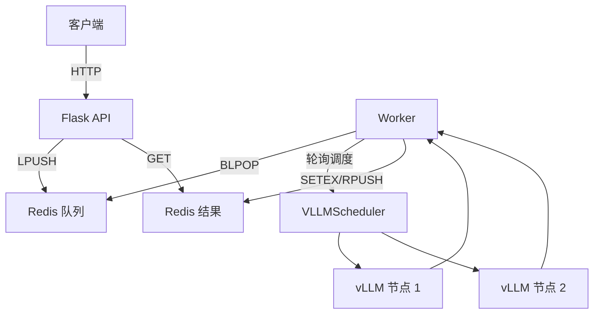
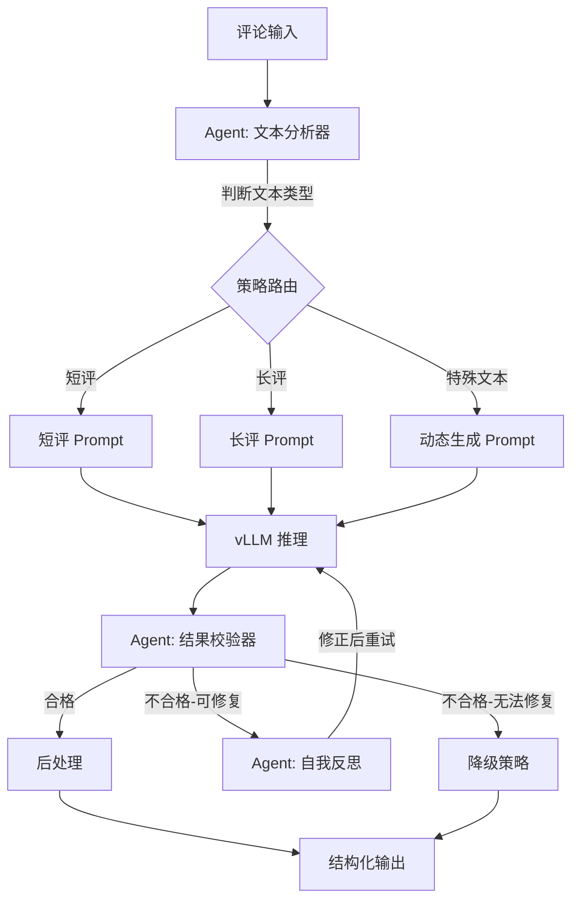
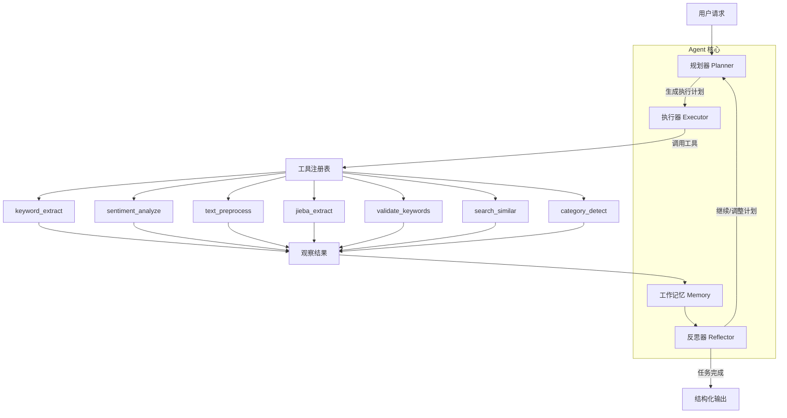
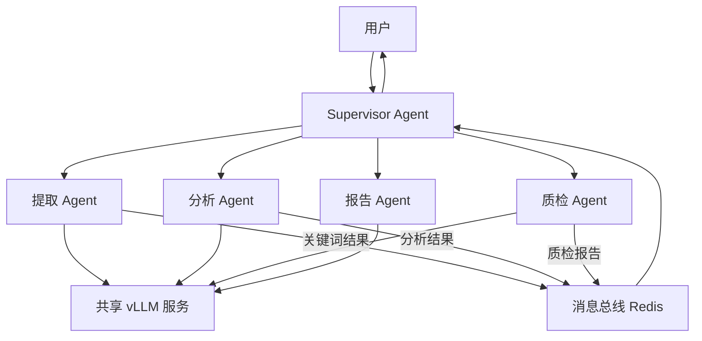

# 中文电商评论分析系统升级为 AI Agent 的可行性分析与实施方案

---

## 一、结论先行：可行，但需要清晰定义「Agent 的边界」

**可行性判定：有条件可行。**

将 `chineseproductcomment` 项目升级为 AI Agent 项目是**技术上完全可行的**，但需要明确一个关键前提：**你要的 Agent 是什么级别的 Agent？** 不同级别的 Agent 升级成本和收益差异巨大。

下面从三个层次展开分析。

---

## 二、当前系统现状评估

### 2.1 当前架构（非 Agent）



### 2.2 当前系统的「智能」清单

| 能力 | 当前实现方式 | Agent 视角的评价 |
|------|-------------|----------------|
| 文本理解 | LLM (Qwen 7B) + CoT Prompt | 有，但仅单轮推理 |
| 格式控制 | `response_format=json_object` + 后处理校验 | 有，但属于被动校验而非主动纠错 |
| 错误恢复 | 重试 + 改变惩罚参数 + Jieba 兜底 + 原文截断 | 有层级式降级策略，但每层策略是硬编码的 |
| 负载均衡 | `VLLMScheduler` 轮询 + 健康检查 | 有，但与「智能」无关 |
| 长短文本适配 | 根据长度切换 Prompt 模板 | 有条件分支，但不是动态决策 |
| 幻觉检测 | 后处理中的原文对齐 + 跨度校验 | 有规则引擎，但非模型自省 |

### 2.3 当前系统**不具备**的 Agent 核心能力

| Agent 核心能力 | 当前状态 |
|---------------|---------|
| 目标分解与规划（Planning） | 无。流水线是固定的：预处理 → Prompt → LLM → 后处理 → 兜底 |
| 工具使用（Tool Use） | 无。只调 vLLM 一个「工具」，且调用方式写死在代码中 |
| 观察-思考-行动循环（ReAct Loop） | 无。处理流程一旦启动就是线性执行 |
| 记忆与上下文管理（Memory） | 无。每条评论独立处理，无跨请求学习 |
| 自我反思与纠错（Reflection） | 部分有。重试时改变参数，但不是模型自主决策 |
| 多步推理编排（Multi-step Reasoning） | 无。Prompt 中要求 CoT，但系统侧不做多轮交互 |

---

## 三、三个级别的 Agent 升级路线

### Level 1：轻量级 Agent —— 「智能处理管线」（推荐首选）

> 在现有架构上增加 LLM 驱动的动态决策能力，让系统从「固定流水线」升级为「自适应处理管线」。

**核心改造点：**

- 让 LLM 自主决定处理策略（选哪个 Prompt 模板、是否需要二次提取、后处理参数如何调整）
- 引入自我反思机制：模型对自身输出进行质量评估，不合格时自主决定下一步行动
- 结果质量不达标时，Agent 自主选择「换模板重试 / 调整参数 / 降级到 Jieba / 请求人工审核」

**升级后架构：**



**改动范围：**
- 改造 `core/processor.py`：将 `process_single` 中的硬编码 if-else 替换为 LLM 驱动的路由决策
- 新增 `core/agent_router.py`：文本分析 + 策略选择 Agent
- 新增 `core/agent_validator.py`：结果自校验 + 反思修正 Agent
- `config.py` 增加 Agent 相关配置项

**技术栈增量：** 几乎为零，复用现有 vLLM + OpenAI SDK

**预估工作量：** 1-2 周

**收益：**
- 面试叙事从「我搭了一条流水线」升级为「我设计了一个能自主决策的智能系统」
- 实际效果提升：减少不必要的重试、提高边界 case 的处理质量
- 代码改动最小，风险最低

---

### Level 2：标准 Agent —— 「多工具协作的评论分析 Agent」

> 构建一个真正的 ReAct Agent，配备多个可调用工具，能够自主规划分析步骤。

**核心改造点：**

- 定义标准的 Tool Schema（工具注册表）
- 实现 ReAct 循环：Thought → Action → Observation → Thought → ...
- Agent 能根据评论内容动态选择工具组合

**工具清单设计：**

| 工具名 | 功能 | 对应现有模块 |
|--------|------|-------------|
| `keyword_extract` | 调用微调 LLM 提取关键词 | `core/processor.py` |
| `sentiment_analyze` | 情感分析 | 新增（可复用同一 LLM） |
| `text_preprocess` | 文本清洗与规范化 | `core/preprocess.py` |
| `jieba_extract` | Jieba 关键词提取 | `core/fallback_extractor.py` |
| `validate_keywords` | 校验关键词是否在原文中 | `core/post_process.py` |
| `search_similar_reviews` | 检索相似评论（向量检索） | 新增 |
| `category_detect` | 商品品类识别 | 新增 |
| `summarize_batch` | 批量评论摘要生成 | 新增 |

**升级后架构：**



**关键代码结构：**

```
chineseproductcomment/
├── agent/                      # 新增：Agent 核心
│   ├── __init__.py
│   ├── agent.py               # ReAct Agent 主循环
│   ├── planner.py             # 任务规划器
│   ├── memory.py              # 工作记忆（短期 + 长期）
│   ├── reflector.py           # 反思与自我纠错
│   └── tool_registry.py       # 工具注册与调用协议
├── tools/                      # 新增：标准化工具
│   ├── __init__.py
│   ├── base_tool.py           # 工具基类（统一输入/输出 schema）
│   ├── keyword_tool.py        # 关键词提取工具（封装现有 processor）
│   ├── sentiment_tool.py      # 情感分析工具
│   ├── preprocess_tool.py     # 预处理工具
│   ├── validate_tool.py       # 校验工具
│   ├── jieba_tool.py          # Jieba 兜底工具
│   └── retrieval_tool.py      # 相似评论检索工具
├── core/                       # 保留：底层能力模块
├── api/                        # 改造：API 层对接 Agent
├── tasks/                      # 改造：Worker 调用 Agent
└── ...
```

**技术栈增量：**
- **Agent 框架**（二选一）：
  - **方案 A：LangChain / LangGraph**（生态最成熟，社区最大，但较重）
  - **方案 B：自研轻量 Agent 循环**（推荐，因为项目已有 vLLM + OpenAI SDK，无需引入额外抽象层，面试时更能体现深度）
- **向量数据库**（若加检索工具）：FAISS / Milvus / Chroma
- **Embedding 模型**：`bge-large-zh-v1.5` 或 `text2vec-large-chinese`

**预估工作量：** 3-5 周

**收益：**
- 简历上可以写「设计并实现了基于 ReAct 范式的多工具 AI Agent」
- 系统具备真正的自主决策能力，可处理开放式分析请求
- 可扩展性极强，新增分析能力只需注册新工具

---

### Level 3：高级 Agent —— 「多 Agent 协作的评论分析平台」

> 构建多个专业化 Agent，通过协调器实现复杂的多 Agent 协作。

**核心改造点：**

- 多个专业 Agent：提取 Agent、分析 Agent、质检 Agent、报告 Agent
- Agent 间通过消息传递协作
- 引入 Supervisor Agent 进行任务编排

**升级后架构：**



**技术栈增量：**
- **多 Agent 框架**：LangGraph（推荐） / CrewAI / AutoGen
- **消息协议**：可复用现有 Redis Pub/Sub
- **状态管理**：Redis + 持久化存储（PostgreSQL / MongoDB）
- **前端**（可选）：Streamlit / Gradio 做可视化交互界面

**预估工作量：** 6-10 周

**收益：**
- 项目定位从「工具」升级为「平台」
- 可处理复杂的多步骤分析任务（如：「分析最近一个月手机品类的差评趋势，找出核心问题并生成报告」）
- 面试价值最高，但也要做好被深度追问的准备

---

## 四、推荐方案：Level 1 + Level 2 核心模块

综合考虑**面试价值、实现成本、技术深度**三个维度，推荐采用以下组合方案：

### 4.1 升级范围

在 Level 1 的基础上，引入 Level 2 的工具注册和 ReAct 循环，但**不引入多 Agent 协作**（避免过度工程化）。

### 4.2 具体实施步骤

#### 第一阶段：工具化封装（第 1 周）

将现有模块封装为标准工具：

```python
# tools/base_tool.py 示例结构
from abc import ABC, abstractmethod
from typing import Any, Dict
from pydantic import BaseModel

class ToolInput(BaseModel):
    """工具输入的基类"""
    pass

class ToolOutput(BaseModel):
    """工具输出的基类"""
    success: bool
    data: Any
    error: str = ""

class BaseTool(ABC):
    name: str
    description: str
    input_schema: type  # Pydantic model

    @abstractmethod
    def run(self, input_data: ToolInput) -> ToolOutput:
        pass

    def to_openai_function(self) -> Dict:
        """转换为 OpenAI Function Calling 格式"""
        return {
            "type": "function",
            "function": {
                "name": self.name,
                "description": self.description,
                "parameters": self.input_schema.model_json_schema()
            }
        }
```

#### 第二阶段：Agent 核心循环（第 2 周）

实现 ReAct 循环：

```python
# agent/agent.py 示例结构
class ReviewAnalysisAgent:
    def __init__(self, llm_client, tools, max_steps=10):
        self.llm = llm_client
        self.tools = {t.name: t for t in tools}
        self.max_steps = max_steps
        self.memory = []  # 工作记忆

    def run(self, user_request: str) -> dict:
        """ReAct 主循环"""
        self.memory = [{"role": "user", "content": user_request}]

        for step in range(self.max_steps):
            # 1. Thought: LLM 思考下一步行动
            response = self.llm.chat.completions.create(
                model=self.model_name,
                messages=self._build_messages(),
                tools=[t.to_openai_function() for t in self.tools.values()],
                tool_choice="auto"
            )

            message = response.choices[0].message

            # 2. 如果 LLM 决定直接回答（无需工具）
            if not message.tool_calls:
                return self._parse_final_answer(message.content)

            # 3. Action: 执行工具调用
            for tool_call in message.tool_calls:
                tool_name = tool_call.function.name
                tool_args = json.loads(tool_call.function.arguments)

                # 4. Observation: 获取工具执行结果
                result = self.tools[tool_name].run(tool_args)
                self.memory.append({
                    "role": "tool",
                    "tool_call_id": tool_call.id,
                    "content": json.dumps(result, ensure_ascii=False)
                })

        return {"error": "达到最大步数限制"}
```

#### 第三阶段：自反思机制（第 3 周）

增加结果质量自评估：

```python
# agent/reflector.py 示例结构
class ResultReflector:
    """对提取结果进行自我反思和修正"""

    def reflect(self, original_text, extracted_keywords, llm_client):
        """
        让 LLM 检查自己的提取结果：
        1. 是否有遗漏的关键信息？
        2. 提取的词是否真的在原文中？
        3. 分数排序是否合理？
        """
        reflection_prompt = f"""
        请审查以下关键词提取结果的质量：

        原文：{original_text}
        提取结果：{json.dumps(extracted_keywords, ensure_ascii=False)}

        请检查：
        1. 是否有重要信息被遗漏？
        2. 是否有不在原文中的幻觉词？
        3. 重要性评分是否合理？

        如果发现问题，请输出修正后的结果；如果没有问题，输出 "PASS"。
        """
        # ... 调用 LLM 进行反思
```

#### 第四阶段：API 层改造 + 集成测试（第 4 周）

- 新增 `/api/agent/analyze` 接口，接受自然语言指令
- 保留原有 `/api/extract_single` 和 `/api/extract_batch` 接口（向后兼容）
- 编写端到端测试

### 4.3 完整技术栈

| 层次 | 技术选型 | 选择理由 |
|------|---------|---------|
| LLM 推理 | **vLLM**（保留） | 已验证的高性能推理引擎，支持 Function Calling |
| 基座模型 | **Qwen2.5-7B-Instruct**（保留） | 已完成 SFT+DPO+GRPO 微调，Function Calling 能力良好 |
| Agent 框架 | **自研轻量循环**（推荐） | 不引入 LangChain 等重框架，面试时更能展示底层理解 |
| 工具协议 | **OpenAI Function Calling** | 业界标准，vLLM 原生支持 |
| 任务队列 | **Redis**（保留） | 已有基础设施 |
| API 框架 | **Flask**（保留） | 已有基础设施 |
| 向量检索 | **FAISS**（可选） | 轻量、无需额外部署 |
| 数据验证 | **Pydantic v2** | 工具输入输出的 Schema 校验 |
| 配置管理 | **python-dotenv + dataclass** | 替代现有硬编码 Config |
| 容器化 | **Docker**（保留） | 已有 Dockerfile |

---

## 五、可行的原因（6 条）

1. **LLM 能力就绪**：Qwen2.5-7B-Instruct 原生支持 Function Calling / Tool Use，且经过 SFT+DPO+GRPO 微调后格式遵循能力极强，可以直接作为 Agent 的「大脑」。

2. **vLLM 支持 Function Calling**：vLLM 从 v0.4+ 开始支持 OpenAI 兼容的 `tools` 参数，无需更换推理引擎。

3. **现有模块天然适合工具化**：`preprocess.py`、`processor.py`、`post_process.py`、`fallback_extractor.py` 各自职责清晰、输入输出明确，封装为 Tool 只需加一层薄接口。

4. **Redis 基础设施可复用**：Agent 的工作记忆、任务状态、中间结果均可存储在 Redis 中，无需引入新的中间件。

5. **RL 微调经验可迁移**：已有的 GRPO 奖励函数设计经验可以直接用于训练 Agent 的工具选择策略。`reward_functions_2.py` 中的多维奖励设计思路，可以扩展为 Agent 行为的奖励信号。

6. **StructAlign 的 Schema 驱动设计可融合**：同一 Framework 下的 `StructAlign` 项目已经有了 `TaskSchema`、`FieldDefinition`、`PromptBuilder` 等抽象，可以作为 Agent 工具的类型系统和约束框架。

---

## 六、需要注意的风险与挑战（4 条）

### 6.1 延迟膨胀风险

Agent 的 ReAct 循环意味着**多次 LLM 调用**。假设每次推理 1-2 秒，3 步循环就是 3-6 秒，比现在的单次调用慢 2-3 倍。

**缓解方案：**
- 对简单评论（短评、情感明确），直接走快速路径（单次调用），不进入 Agent 循环
- 设置 `max_steps` 上限和总超时
- 使用 vLLM 的 Prefix Caching 加速多轮对话中的重复 Prefix

### 6.2 7B 模型的 Agent 能力瓶颈

7B 模型在复杂工具选择和多步规划上可能不如 70B+ 模型。

**缓解方案：**
- 限制工具数量（5-7 个），降低选择复杂度
- 通过 SFT 专门训练 Agent 行为数据（工具调用的 trajectory）
- 提供清晰的工具描述和 few-shot 示例

### 6.3 评估体系重建

Agent 的评估不能只看关键词准确率，还需要评估规划合理性、工具选择正确性、循环效率。

**缓解方案：**
- 构建 Agent 行为轨迹的评测数据集
- 定义多维指标：任务完成率、平均步数、工具调用准确率、端到端延迟

### 6.4 过度工程化风险

如果当前业务场景只需要「批量提取关键词」，Agent 可能是过度设计。

**缓解方案：**
- 保持向后兼容，原有接口不变
- Agent 模式作为「增强模式」提供，而非替代
- 面试时明确说明「为什么在这个场景引入 Agent 是合理的」（如：需要处理开放式分析请求、需要跨任务编排等）

---

## 七、面试价值最大化的叙事策略

升级为 Agent 后，你的项目描述可以从：

> ❌「基于 vLLM 的评论关键词提取服务」

升级为：

> ✅「基于 ReAct 范式的电商评论智能分析 Agent，支持多工具协作、自反思纠错和自适应处理策略，底层通过 SFT+DPO+GRPO 三阶段训练实现 7B 模型的 Agent 能力对齐」

**面试时可以主动展开的技术亮点：**

1. **为什么自研 Agent 循环而不用 LangChain？** —— LangChain 抽象层太厚，对于 vLLM 原生 Function Calling 场景反而增加了不必要的复杂度；自研可以精确控制每一步的超时、重试、降级策略。

2. **如何解决 7B 模型做 Agent 的能力不足？** —— 通过限制工具数量 + SFT 训练工具调用 trajectory + GRPO 强化工具选择策略。

3. **Agent 带来了什么 pipeline 无法实现的能力？** —— 动态适配：面对从未见过的评论类型（如：混合中英文的跨境电商评论），Agent 可以自主选择先做语言检测、再选择合适的提取策略，而固定 pipeline 需要人工新增分支。

4. **如何保证 Agent 不会无限循环？** —— 设计了三重保护：max_steps 硬限制 + 总超时 + 反思器检测到重复行为时强制终止并降级。

---

## 八、从固定流水线到 Agent 的关键代码改造对照表

| 现有代码 | 改造方向 | 改造内容 |
|---------|---------|---------|
| `core/processor.py` (`KeywordExtractor`) | 封装为 `tools/keyword_tool.py` | `process_single` 方法包装为 Tool，统一输入输出 |
| `core/preprocess.py` | 封装为 `tools/preprocess_tool.py` | 预处理逻辑不变，加 Tool 壳 |
| `core/post_process.py` | 封装为 `tools/validate_tool.py` | 后处理校验逻辑封装为独立工具 |
| `core/fallback_extractor.py` | 封装为 `tools/jieba_tool.py` | Jieba 提取作为降级工具 |
| `core/prompt_template_3.py` | 保留，供 `keyword_tool` 内部使用 | 不变 |
| `core/vllm_scheduler.py` | 保留，Agent 和 Tool 共享 vLLM 调度 | 不变 |
| `tasks/worker.py` | 改造，Worker 调用 Agent 而非直接调 Processor | 替换 `extractor.process_batch` 为 `agent.run` |
| `api/routes.py` | 新增 Agent 模式接口 | 增加 `/api/agent/analyze` |
| `config.py` | 扩展 Agent 配置 | 增加 `AGENT_MAX_STEPS`、`AGENT_TIMEOUT` 等 |

---

## 九、总结

| 维度 | 评估 |
|------|------|
| 技术可行性 | 完全可行。现有模块职责清晰，适合工具化封装；vLLM + Qwen 支持 Function Calling |
| 业务价值 | 中等。纯关键词提取场景 Agent 可能过重，但可扩展为多任务分析平台 |
| 面试价值 | 极高。从「搭流水线的工程师」升级为「设计 Agent 系统的架构师」 |
| 推荐路线 | Level 1 + Level 2 核心模块，自研轻量 Agent 循环，4 周可完成 |
| 核心技术栈 | vLLM + Qwen + OpenAI Function Calling + Redis + Flask + Pydantic + 自研 ReAct 循环 |
| 最大风险 | 延迟膨胀（多轮调用）和 7B 模型 Agent 能力瓶颈，需通过快速路径和 RL 训练缓解 |

